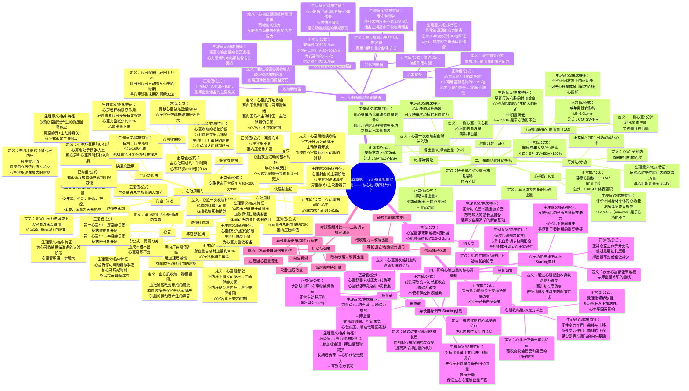

```mermaid
mindmap
  root((第四章第一节 心脏的泵血功能 —— 核心名词解释共26个))
    一、心动周期与泵血过程
      心动周期
        定义：心脏一次收缩和舒张<br/>构成的机械活动周期<br/>包括收缩期和舒张期
        正常值/公式：心动周期=60÷心率<br/>心率75次/min时为0.8s
        生理意义/临床特征：<br/>心脏泵血活动的基本时间单位<br/>与心率成反比<br/>心动过速时舒张期缩短比例更大
      心率（HR）
        定义：单位时间内心脏搏动的次数
        正常值/公式：<br/>安静状态正常成年人60~100次/min
        生理意义/临床特征：<br/>决定心动周期长度和心输出量<br/>受年龄、性别、睡眠、神经、<br/>体液、体温等因素影响
      全心舒张期
        定义：心室舒张期前0.4s内<br/>心房也处于舒张状态<br/>即心房和心室同时舒张的时期
        正常值/公式：<br/>占心动周期约一半时间<br/>心率75次/min时约0.4s
        生理意义/临床特征：<br/>有利于心室充盈<br/>保证冠脉供血<br/>冠脉血流主要在舒张期灌注
      等容收缩期
        定义：心室肌开始收缩<br/>室内压急剧升高→房室瓣关闭<br/>室内压仍＜主动脉压→主动脉瓣仍关闭<br/>心室容积不变的时期
        正常值/公式：两瓣均关<br/>心室容积不变<br/>室内压急剧升高
        生理意义/临床特征：<br/>心室收缩的起始阶段<br/>为射血建立压力梯度<br/>室内压上升最快的时期<br/>后负荷增大时此期延长
      快速射血期
        定义：心室肌继续收缩<br/>室内压升高＞动脉压<br/>主动脉瓣开放<br/>血液由心室快速射入动脉的时期
        正常值/公式：<br/>射血量占总射血量约70%<br/>室内压达峰值
        生理意义/临床特征：<br/>心室射血的主要阶段<br/>心室容积迅速减小<br/>房室瓣关+主动脉瓣开
      减慢射血期
        定义：室内压由峰值逐渐下降<br/>射血速度减慢<br/>依靠惯性继续射血的时期
        正常值/公式：<br/>射血量占总射血量约30%<br/>心室容积减至最低
        生理意义/临床特征：<br/>室内压已略低于动脉压<br/>血液靠惯性继续射出<br/>体现动脉的弹性储器作用
      等容舒张期
        定义：心室肌舒张<br/>室内压下降＜动脉压→主动脉瓣关闭<br/>室内压仍＞房内压→房室瓣仍关闭<br/>心室容积不变的时期
        正常值/公式：两瓣均关<br/>血液不进不出<br/>心室容积不变
        生理意义/临床特征：<br/>心室舒张的起始阶段<br/>室内压急剧下降<br/>为心室充盈做准备
      快速充盈期
        定义：室内压继续下降＜房内压<br/>房室瓣开放<br/>血液由心房快速流入心室<br/>心室容积迅速增大的时期
        正常值/公式：<br/>充盈量占总充盈量的大部分
        生理意义/临床特征：<br/>依赖心室舒张产生的负压抽吸效应<br/>房室瓣开+主动脉瓣关<br/>心室充盈的主要阶段
      减慢充盈期
        定义：房室间压力梯度减小<br/>入室血流速度减慢<br/>心室容积继续增大的时期
        正常值/公式：<br/>充盈速度较快速充盈期明显减慢
        生理意义/临床特征：<br/>为心房收缩期做准备的过渡阶段<br/>心室容积进一步增大
      心房收缩期
        定义：心房收缩→房内压升高<br/>血液由心房主动挤入心室的时期<br/>是心室舒张末期的最后0.1s
        正常值/公式：<br/>贡献心室总充盈量约1/4<br/>心室容积在此期结束后达最大
        生理意义/临床特征：<br/>心房发挥初级泵作用<br/>房颤患者心房丧失有效收缩<br/>心室充盈减少约25%<br/>心输出量下降
      心音
        定义：由心肌收缩、瓣膜启闭、<br/>血液流速改变形成的涡流<br/>和血液撞击心室壁/大动脉壁<br/>引起的振动所产生的声音
        正常值/公式：<br/>第一心音S1：房室瓣关闭<br/>标志收缩期开始<br/>第二心音S2：半月瓣关闭<br/>标志舒张期开始
        生理意义/临床特征：<br/>心音听诊可判断瓣膜状态<br/>和心动周期时相<br/>杂音提示瓣膜病变
    二、泵血功能评价指标
      搏出量/每搏输出量（SV）
        定义：一侧心室一次心搏<br/>所射出的血液量<br/>简称搏出量
        正常值/公式：<br/>安静状态下约70mL<br/>公式：SV=EDV-ESV
        生理意义/临床特征：<br/>心功能的基础参数<br/>可反映单次心搏的射血能力
      射血分数（EF）
        定义：搏出量占心室舒张末期容积<br/>的百分比
        正常值/公式：<br/>健康成年人55%~65%<br/>公式：EF=SV÷EDV×100%
        生理意义/临床特征：<br/>更能反映心脏的射血效率<br/>心室功能减退/异常扩大的患者<br/>EF明显降低<br/>EF＜50%提示心功能不全
      心输出量/每分输出量（CO）
        定义：一侧心室1分钟<br/>射出的血液量<br/>又称每分输出量
        正常值/公式：<br/>成年男性安静时4.5~6.0L/min<br/>公式：CO=SV×HR
        生理意义/临床特征：<br/>评价不同状态下的心功能<br/>反映心脏整体泵血能力的核心指标
      心指数（CI）
        定义：单位体表面积的心输出量
        正常值/公式：<br/>静息心指数3.0~3.5L/（min·m²）<br/>公式：CI=CO÷体表面积
        生理意义/临床特征：<br/>评价不同身材个体的心功能<br/>消除体型差异影响<br/>CI＜2.5L/（min·m²）提示心功能不全
      每搏功/搏功
        定义：心室一次收缩射血所做的功
        正常值/公式：<br/>搏功=搏出量×<br/>（平均动脉压-平均心房压）<br/>+血流动能
        生理意义/临床特征：<br/>用心脏做功比单纯泵血量更全面<br/>血压升高时心脏需做更多功<br/>才能射出等量血液
      每分功/分功
        定义：心室1分钟内<br/>收缩射血所做的功
        正常值/公式：分功=搏功×心率
        生理意义/临床特征：<br/>反映心脏单位时间内的总做功量<br/>与心肌耗氧量密切相关
    三、心脏泵血功能的储备
      心力储备/心泵功能储备
        定义：心输出量随机体代谢需要<br/>而增加的能力<br/>反映泵血功能对代谢的适应能力
        正常值/公式：<br/>安静时CO约5L/min<br/>剧烈运动时可达25~30L/min<br/>为安静时的5~6倍<br/>运动员可达40L/min
        生理意义/临床特征：<br/>心力储备=搏出量储备+心率储备<br/>心力储备降低<br/>是心功能减退的早期表现
      收缩期储备
        定义：通过增强心肌收缩力<br/>减少收缩末期容积<br/>而增加搏出量的储备方式
        正常值/公式：<br/>正常成年人约35~40mL<br/>是搏出量储备的主要构成
        生理意义/临床特征：<br/>提高心输出量的重要途径<br/>心力衰竭时收缩期储备首先受损
      舒张期储备
        定义：通过增加心室舒张末期容积<br/>而增加搏出量的储备方式
        正常值/公式：仅约15mL<br/>储备作用有限
        生理意义/临床特征：<br/>受心包限制<br/>舒张末期容积不能无限增大<br/>储备空间远小于收缩期储备
      心率储备
        定义：通过加快心率<br/>而增加心输出量的储备能力
        正常值/公式：<br/>心率达160~180次/分时<br/>CO可增至静息时的2~2.5倍<br/>心率＞180次/分→CO反而降低
        生理意义/临床特征：<br/>最常被调动的心力储备<br/>心率＜40次/分时CO也降低<br/>运动、应激时主要动用此储备
    四、影响心输出量的核心调节机制
      前负荷
        定义：肌肉收缩前所承受的负荷<br/>使肌肉被拉长到初长度
        正常值/公式：<br/>心室舒张末期压力≈前负荷<br/>心室舒张末期容积≈初长度
        生理意义/临床特征：<br/>前负荷↑→初长度↑→收缩力增强<br/>→搏出量↑<br/>受充盈时间、回流速度、<br/>心包内压、顺应性等因素影响
      初长度
        定义：肌肉在前负荷作用下<br/>被拉长的长度
        正常值/公式：<br/>心室舒张末期容积≈初长度<br/>心肌最适初长约2.0~2.2μm
        生理意义/临床特征：<br/>正常初长度＜最适初长度<br/>故有较大的初长度储备<br/>是异长自身调节的解剖基础
      心室功能曲线/Frank-Starling曲线
        定义：表示心室舒张末容积<br/>与搏出量关系的曲线
        正常值/公式：<br/>正常心室工作于升支段<br/>超过最适初长度后<br/>搏出量不变或轻微减少
        生理意义/临床特征：<br/>反映心肌的异长自身调节能力<br/>心室肌不出现降支<br/>是区别于骨骼肌的重要特征
      异长自身调节/Starling机制
        定义：通过改变心肌细胞初长度<br/>而引起心肌收缩强度改变<br/>进而调节搏出量的机制
        正常值/公式：<br/>前负荷改变→初长度改变<br/>→收缩力改变<br/>不依赖神经体液因素
        生理意义/临床特征：<br/>对搏出量微小变化进行精细调节<br/>使心室射血量与静脉回心血量<br/>保持平衡<br/>保证左右心室输出量平衡
      后负荷
        定义：心室肌收缩射血时<br/>必须对抗的负荷
        正常值/公式：<br/>大动脉血压=心室收缩后负荷<br/>正常主动脉压约80~120mmHg
        生理意义/临床特征：<br/>后负荷↑→等容收缩期延长<br/>→射血期缩短→搏出量暂时减少<br/>长期后负荷↑→心肌代偿性肥大<br/>→可致心力衰竭
      心肌收缩能力/变力状态
        定义：心肌不依赖于前后负荷<br/>而改变收缩强度和速度的<br/>内在特性
        正常值/公式：<br/>受活化横桥数目、<br/>肌球蛋白ATP酶活性、<br/>心率等因素影响
        生理意义/临床特征：<br/>正性变力作用→曲线左上移<br/>负性变力作用→曲线右下移<br/>是实现等长调节的内在基础
      等长调节
        定义：通过心肌细胞本身收缩能力改变<br/>而非初长度改变<br/>使搏出量发生改变的调节方式
        正常值/公式：<br/>等长意为前负荷不变而搏出量改变<br/>区别于异长自身调节
        生理意义/临床特征：<br/>适应代谢需求的变化<br/>与异长自身调节协同配合<br/>是神经体液调节的主要途径
    考试高频对比——三类调节机制速查
      异长自身调节/前负荷调节
        改初长度→改搏出量
        适应回心血量变化
        内在机制
      等长调节/收缩能力调节
        改收缩力→改搏出量
        适应代谢需求变化
        依赖神经体液
      后负荷调节
        动脉血压改变
        暂时影响搏出量
        继而引发异长自身调节代偿
```
